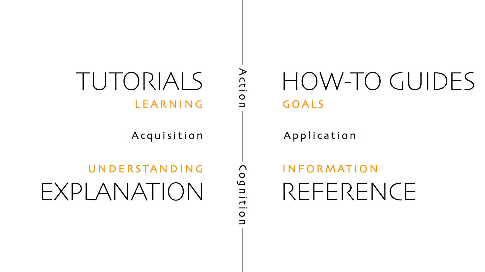

# Diataxis 

A systematic approach to technical documentation authoring.  

---

> Diátaxis, from the Ancient Greek δῐᾰ́τᾰξῐς: dia (“across”) and taxis (“arrangement”).

[diataxis.fr](https://diataxis.fr)